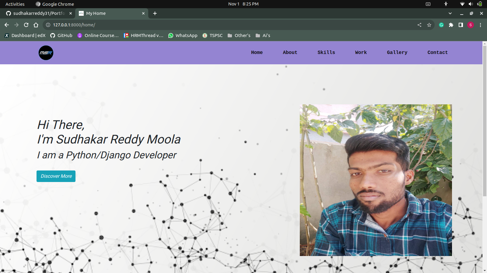

# Portfolio_Website

## The Main Page 

Tech Stack:
--------------

&nbsp;
&nbsp;
&nbsp;
&nbsp;
&nbsp;
&nbsp;

### Links Of Pages
----------------------------------

1.http://127.0.0.1:8000/about/  
2.http://127.0.0.1:8000/skills/  
3.http://127.0.0.1:8000/work/  
4.http://127.0.0.1:8000/gallery/  
5.http://127.0.0.1:8000/contact/  

## Social Media

&nbsp;

-------

### Happy Learning...!

